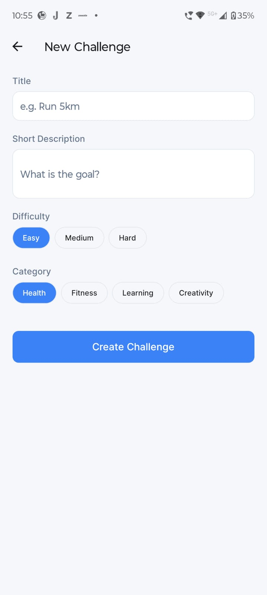
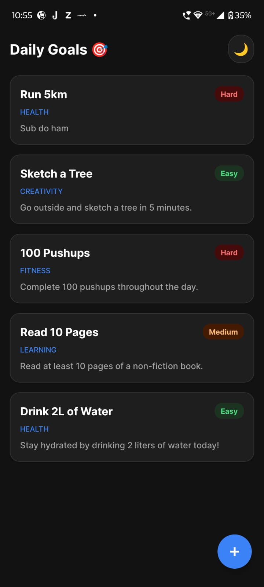
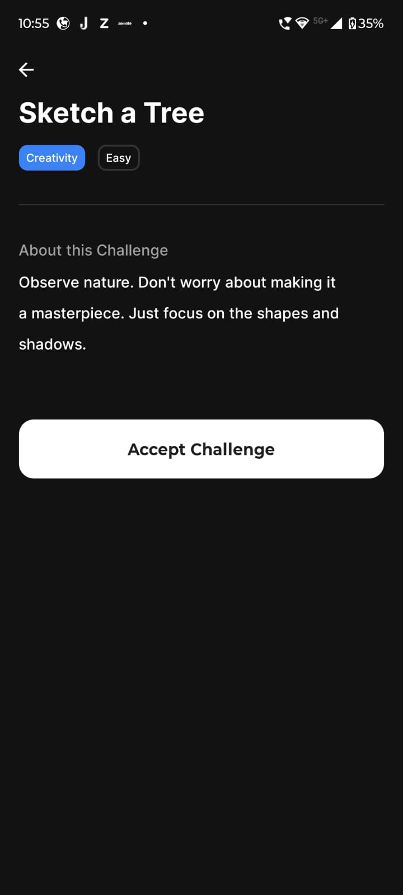
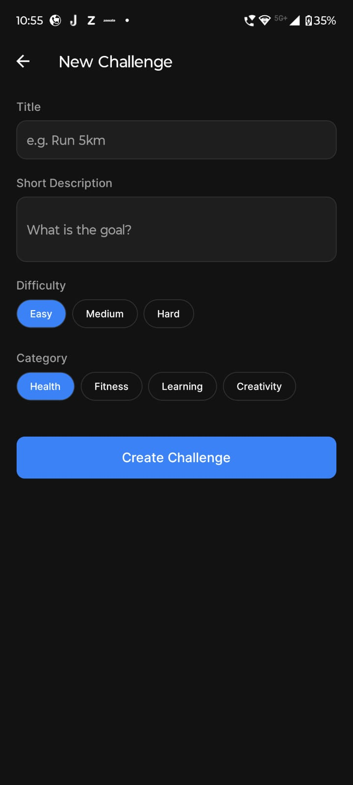

# Daily Challenges App

A robust, cross-platform mobile application built with React Native (Expo SDK 54) and TypeScript. This app allows users to view, track, and create daily challenges to improve their habits.

The project demonstrates a scalable architecture, utilizing modern design patterns, strict typing, and persistent local storage.

## Features

### Core Requirements

* **Challenge Feed**: A performant FlatList displaying active challenges with visual difficulty indicators.
* **Details View**: A dedicated screen showing full descriptions, difficulty, and category tags.
* **Strict Typing**: All data flow is managed via TypeScript interfaces (`Challenge` type).

### Senior-Level Bonuses (Implemented)

* **Dark Mode Support**: Automatic theme detection using a custom `useThemeColors` hook. Adapts seamlessly to system settings.
* **Data Persistence**: Uses AsyncStorage to persist new challenges across app restarts.
* **Native Animations**: Utilizes React Native's core `LayoutAnimation` for smooth list updates.
* **Create Challenge Form**: A modal-based form with validation to add custom user challenges.
* **Glassmorphism UI**: Custom "Success Modal" implementation replacing standard system alerts.

## Tech Stack & Decisions

| Technology       | Usage       | Justification                                                                                |
| ---------------- | ----------- | -------------------------------------------------------------------------------------------- |
| Expo SDK 54      | Framework   | Chosen for rapid prototyping and access to the latest React Native 0.81 features.            |
| TypeScript       | Language    | Ensures type safety and reduces runtime errors by strictly defining data models.             |
| Tamagui          | UI Library  | Used for consistent token-based styling; running in Runtime Mode for React 19 compatibility. |
| Context API      | State Mgmt  | Lightweight solution for global state without Redux overhead.                                |
| AsyncStorage     | Persistence | Standard solution for persisting simple JSON data to disk.                                   |
| React Navigation | Routing     | Native stack navigator for 60fps transitions.                                                |

## Project Architecture

The project follows a Feature-First / Separation of Concerns directory structure:

```
src/
├── components/       # Presentational components (ChallengeCard)
├── screens/          # Container components (Home, Details, Create)
├── context/          # Global State & Logic (ChallengeContext)
├── hooks/            # Custom Logic (useThemeColors)
├── data/             # Types & Mock Data
├── services/         # API abstraction layer
└── theme/            # Tamagui Configuration
```

### Key Architectural Patterns

#### Service Layer Pattern

API calls are abstracted in `services/api.ts`. Currently simulates network delay, but designed to scale to real fetch/Axios without changing UI code.

#### Optimistic UI Updates

UI updates immediately when creating a challenge; AsyncStorage writes happen in the background for a smooth experience.

#### Custom Hook for Theming

`useThemeColors.ts` encapsulates theme logic, keeping UI components focused purely on layout.

## Installation & Running

Ensure Node.js is installed.

### Clone the Repository

```sh
git clone [repo-url]
cd challenge-app
```

### Install Dependencies

Use legacy mode to handle peer dependency conflicts.

```sh
npm install --legacy-peer-deps
```

### Run the App

```sh
npx expo start -c
```

### View the App

* Scan QR code in Expo Go app
* Press `a` to run Android Emulator
* Press `i` to run iOS Simulator

## Known Issues & Workarounds

### Tamagui Compiler & React 19

Expo 54 uses React 19 Beta, which breaks Tamagui's static compiler.

**Solution**: Disabled Tamagui Babel Plugin; running Runtime Mode for full compatibility.

### Reanimated Compatibility

`react-native-reanimated` removed due to version mismatches.

**Alternative**: Using native `LayoutAnimation` for smooth animations.

## Future Improvements

* Integrate React Query for backend-driven state.
* Add unit tests for Context logic.
* Add Zod validation for form inputs.

## ScreenShots








## Author

Built with passion and TypeScript.
Vamshi Krishna